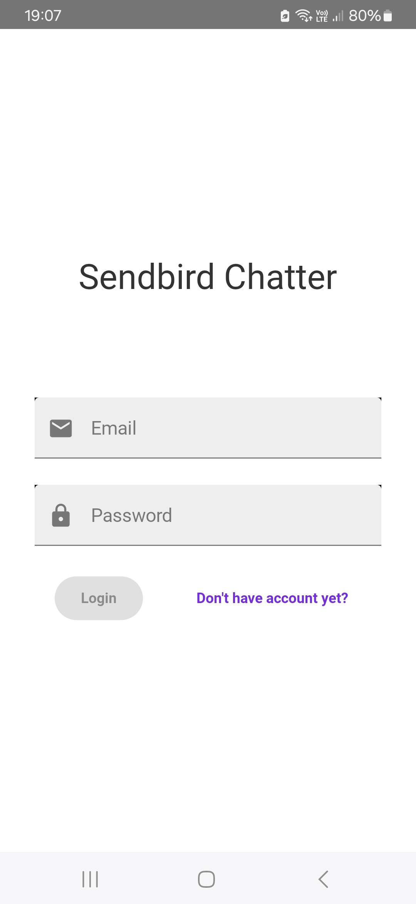
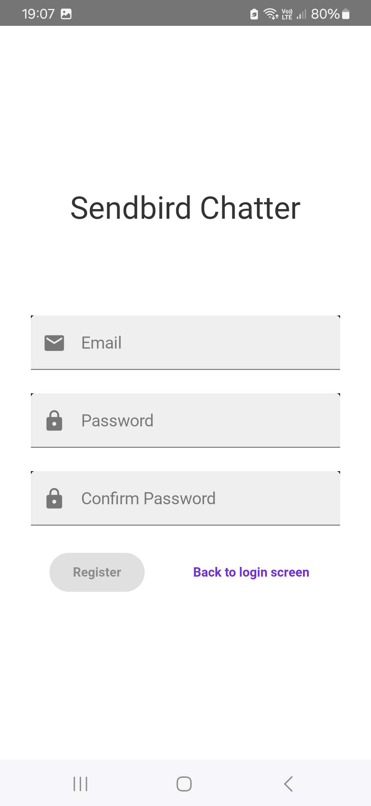
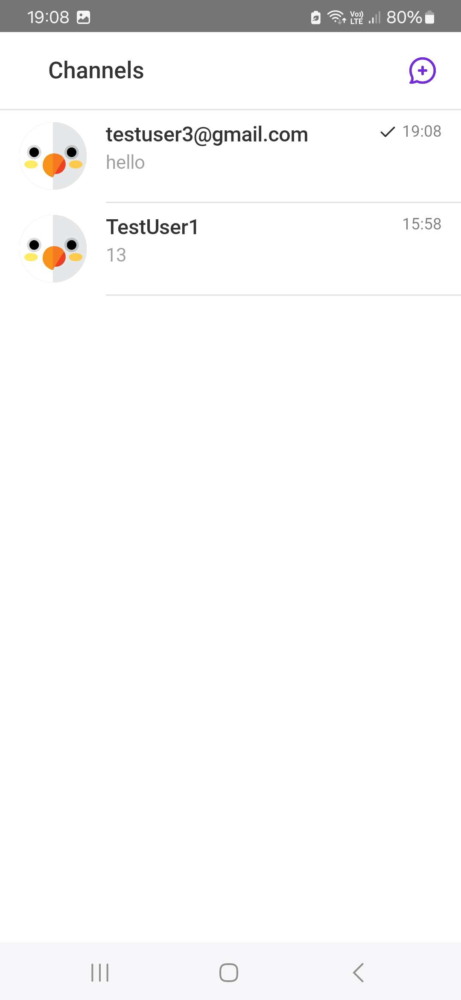
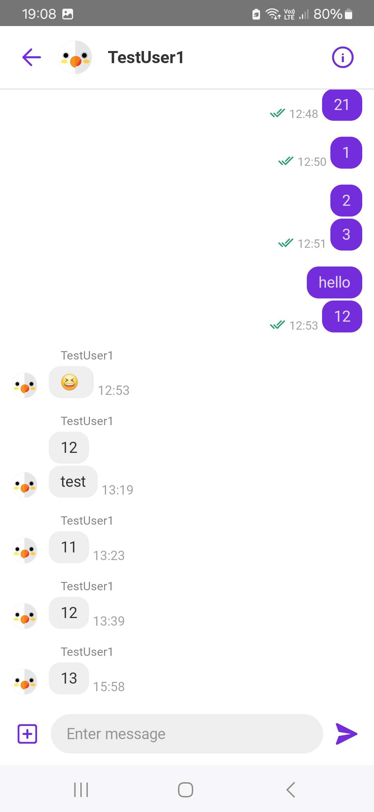
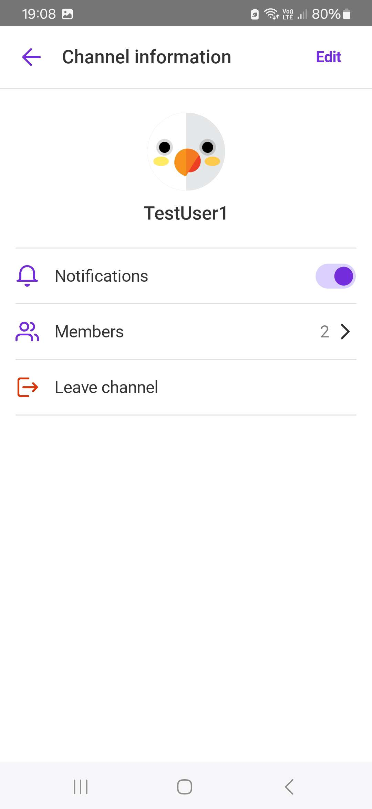

# Sendbird Chatter

Sendbird Chatter is a simple chat application built using **UIKit** and **Sendbird API**. It leverages **Firebase Authentication** for user login and **Firebase Cloud Messaging (FCM)** for push notifications. The chat functionality is powered by **Sendbird UIKit**, which has been customized to fit specific needs.

The main goal of this project was to learn how to integrate existing solutions and implement notifications in an Android application.

## Features

- User authentication and authorization via **Firebase Authentication**
- Real-time chat powered by **Sendbird API and UIKit**
- Push notifications for new messages using **Firebase Cloud Messaging (FCM)**
- Customizations to **Sendbird UIKit** to meet specific requirements
- Clean and intuitive UI for an enhanced user experience

## Technologies Used

- **Android (Kotlin)**
- **Firebase Authentication** – User login and authentication
- **Firebase Cloud Messaging (FCM)** – Push notifications
- **Sendbird API & UIKit** – Real-time chat solution
- **Retrofit2 & OkHttp3** - Sendbird API communication
- **Dagger & Hilt** - Dependency Injection

## Installation

1. Clone the repository:
   ```sh
   git clone https://github.com/Mational/SendbirdChatter.git
   ```
2. Open the project in **Android Studio**.
3. Add your **Firebase configuration file (google-services.json)** to the `app` directory.
4. Configure Sendbird API keys in the project:
   - Obtain your **Sendbird Application ID** from the Sendbird dashboard.
   - Add it to the relevant configuration file.
5. Connect FCM to Sendbird by following this [guide](https://sendbird.com/docs/chat/sdk/v4/android/push-notifications/managing-push-notifications/set-up-push-notifications-for-fcm)
6. Build and run the project on an emulator or physical device.

## Screenshots

| Login Screen | Registration Screen | Chat List | Chat View | Chat Information |
|--------------|---------------------|-----------|-----------|------------------|
|  |  |  |  |  |

## How It Works

1. **User Authentication**: Users sign up or log in using Firebase Authentication.
2. **Chat Interface**: The app fetches chat channels from Sendbird and allows users to send and receive messages in real-time.
3. **Push Notifications**: When a new message arrives, FCM triggers a notification to the recipient.
4. **Customization**: The Sendbird UIKit components are modified to provide a personalized experience.
